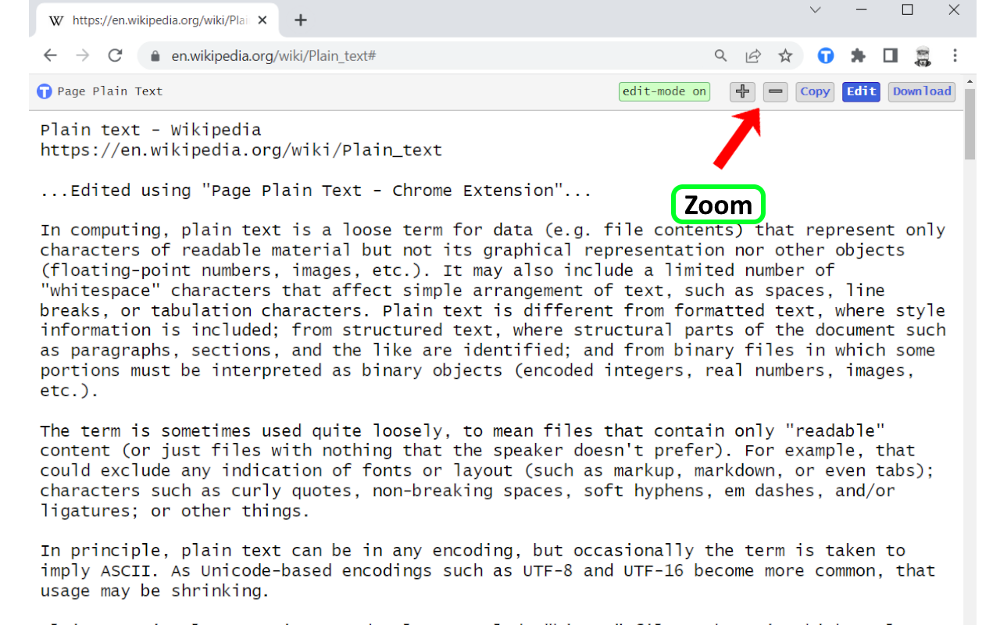

#  Chrome Extension - Page Plain Text 

Chrome extension that shows page plain text and allows you to edit or download the text
## Features

- Shows page plain text (keyboard shortcut: **Ctrl + Shift + 1**)
- Extracts text from the selection on the page
- Text editing
- Download page plain text (keyboard shortcut: **Ctrl + Shift + 2**)
- Removes all formatting from text
- Removes all advertising to focus only on the content of the text
- Copy text to use it in other documents (keyboard shortcut: **Ctrl + Shift + 3**)
- Zoom In and Zoom Out text to improve legibility (keyboard shortcut: **Ctrl + ➕ / Ctrl + ➖**)
- Contextual menu to quickly **copy** or **download** the plain text of the current page
- Dark Mode color scheme

## Keyboard Shortcuts
To change the keyboard shortcuts of the extensions you can go here: [chrome://extensions/shortcuts](chrome://extensions/shortcuts)

# Links
- My Home page: https://www.vincenzodevivo.com/
- My GitHub: https://github.com/deltavi

# ☕BUY ME A COFFEE
Want to buy me a coffee? By all means! Visit 
https://www.buymeacoffee.com/vincenzodevivo or https://www.paypal.com/paypalme/VincenzoDeVivoAutore

... or you can buy my books on Amazon 📚 https://www.amazon.it/Vincenzo-De-Vivo/e/B09MPTBBFY

## Screenshots

 

### Editing
 

### Zoom In/Out 
 

### Context Menu
 

### Dark Mode
 